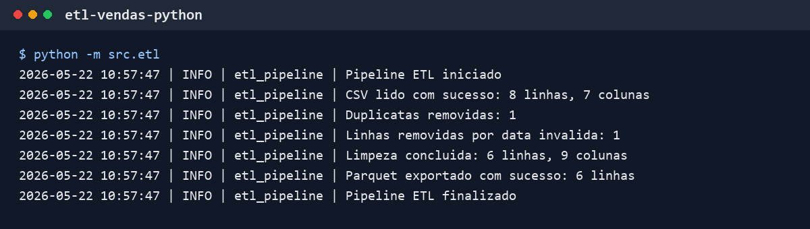
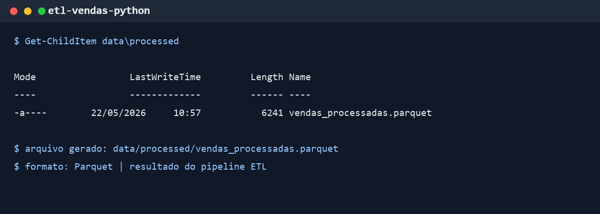

# etl-vendas-python

Projeto introdutório de ETL de vendas com Python e pandas.

A ideia é partir de um CSV pequeno, aplicar algumas regras de limpeza e salvar uma versão tratada em Parquet. É um estudo prático para treinar um fluxo comum em dados, sem tentar parecer um sistema de produção.

```text
CSV bruto -> pandas -> Parquet tratado
```

## Objetivo Do Projeto

- ler dados de vendas a partir de um CSV;
- padronizar nomes de colunas;
- tratar duplicatas, campos vazios e datas inválidas;
- converter colunas numéricas;
- criar a coluna `valor_total`;
- salvar o resultado em Parquet;
- registrar logs simples da execução.

## Tecnologias Utilizadas

- Python
- pandas
- pyarrow
- pathlib
- logging

## Como Executar

Crie e ative um ambiente virtual:

```bash
python -m venv .venv
```

No Windows:

```powershell
.venv\Scripts\activate
```

Instale as dependências:

```bash
python -m pip install -r requirements.txt
```

Execute o ETL com os caminhos padrão:

```bash
python -m src.etl
```

Também dá para informar os caminhos manualmente:

```bash
python -m src.etl --input data/raw/vendas_exemplo.csv --output data/processed/vendas_processadas.parquet --log-file logs/etl_vendas.log
```

## Estrutura De Pastas

```text
etl-vendas-python/
|-- assets/
|   |-- screenshots/
|   |   |-- terminal-etl.png
|   |   |-- parquet-gerado.png
|-- data/
|   |-- raw/
|   |   |-- vendas_exemplo.csv
|-- src/
|   |-- __init__.py
|   |-- config.py
|   |-- etl.py
|   |-- logger.py
|-- .gitignore
|-- README.md
|-- requirements.txt
```

Os arquivos gerados em `data/processed` e `logs` são ignorados pelo Git para manter o repositório leve.

## Exemplo De Uso

Arquivo de entrada:

```csv
ID Venda,Data Venda,Cliente,Produto,Quantidade,Preco Unitario,Desconto
1001,01/05/2026,Ana Silva,Notebook,1,3500.00,150.00
1002,02/05/2026,Bruno Costa,Mouse,2,80.50,0
1003,03/05/2026,Carla Lima,Teclado,1,230.90,10.90
```

Colunas esperadas na saída:

```text
id_venda
data_venda
cliente
produto
quantidade
preco_unitario
desconto
valor_total
data_processamento
```

Regra principal:

```text
valor_total = quantidade * preco_unitario - desconto
```

## Screenshots

### ETL Rodando No Terminal



### Parquet Gerado



## O Que Aprendi

- organizar um projeto Python simples em pastas;
- separar configuração, logs e lógica principal;
- ler CSV com pandas;
- padronizar colunas para `snake_case`;
- tratar valores ausentes, duplicatas e datas inválidas;
- criar uma coluna calculada;
- salvar dados tratados em Parquet;
- usar logs para acompanhar a execução.

## Limitações

- o dataset é fictício e pequeno;
- o pipeline processa um CSV por execução;
- as validações ainda são simples;
- não existe carga em banco de dados;
- ainda não há testes automatizados específicos para este projeto;
- os indicadores analíticos ainda não foram separados em outra camada;
- não existe agendamento automático.

## Próximos Passos

- adicionar testes para as transformações principais;
- criar validações simples de qualidade dos dados;
- gerar métricas por produto e período;
- criar consultas SQL usando SQLite;
- montar um dashboard simples com os indicadores gerados.
