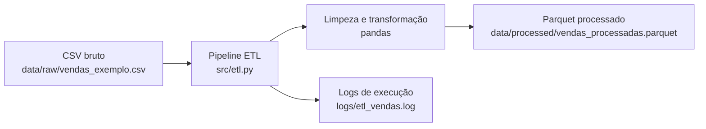

# etl-vendas-python


Projeto simples de ETL de vendas feito para praticar Python, pandas e organização básica de um pipeline de dados.

A ideia é partir de um arquivo CSV pequeno, aplicar algumas regras de limpeza e salvar uma versão processada em Parquet. O foco aqui foi praticar um fluxo comum de dados sem tentar transformar o projeto em algo complexo demais.

## Objetivo

Praticar etapas comuns de um ETL em um cenário simples:

- ler dados de vendas a partir de um CSV;
- padronizar nomes de colunas;
- tratar duplicatas, campos vazios e datas inválidas;
- converter colunas numéricas;
- criar a coluna `valor_total`;
- salvar o resultado em Parquet;
- registrar logs simples da execução.

## Estrutura Do Projeto

```text
etl-vendas-python/
|-- data/
|   |-- raw/
|   |   |-- vendas_exemplo.csv
|   |-- processed/
|       |-- .gitkeep
|-- logs/
|   |-- .gitkeep
|-- assets/
|   |-- screenshots/
|-- src/
|   |-- __init__.py
|   |-- config.py
|   |-- etl.py
|   |-- logger.py
|-- .gitignore
|-- README.md
|-- requirements.txt
```

## Fluxo Do Pipeline



## Tecnologias Usadas

- Python 3.10+
- pandas
- pyarrow
- pathlib
- logging

## O Que Pratiquei

- leitura de arquivos CSV com pandas;
- limpeza e padronização de dados;
- tratamento de valores ausentes e duplicados;
- conversão de datas e números;
- criação de colunas derivadas;
- exportação para Parquet;
- uso de logs para acompanhar a execução;
- organização simples de um projeto Python.

## Aprendizados

Durante este projeto, pratiquei principalmente a separação entre entrada, transformação e saída dos dados.

Também foi útil lidar com alguns problemas simples que aparecem em dados reais, como:
- nomes de colunas inconsistentes;
- datas inválidas;
- campos vazios;
- linhas duplicadas.

Outro aprendizado foi organizar os caminhos principais em um arquivo de configuração simples e permitir que o ETL receba caminhos pela linha de comando. Isso facilitou testar o pipeline com outros arquivos sem precisar alterar o código.

## Limitações

O projeto ainda tem algumas limitações:

- o dataset é fictício e pequeno;
- o pipeline processa um CSV por execução;
- a validação dos dados ainda é simples;
- não existe carga em banco de dados;
- ainda não possui testes automatizados;
- os indicadores ainda são básicos;
- não existe orquestração do pipeline;
- os logs ainda são simples.

A ideia é evoluir o projeto aos poucos, mantendo tudo fácil de entender e explicar.

## Como Instalar

Crie e ative um ambiente virtual:

```bash
python -m venv .venv
```

No Windows:

```powershell
.venv\Scripts\activate
```

No Linux/macOS:

```bash
source .venv/bin/activate
```

Instale as dependências:

```bash
python -m pip install -r requirements.txt
```

## Como Rodar O ETL

Execute com os caminhos padrão:

```bash
python -m src.etl
```

No Windows, se o comando `python` não estiver disponível, use:

```powershell
py -m src.etl
```

Também é possível informar entrada, saída e log manualmente:

```bash
python -m src.etl --input data/raw/vendas_exemplo.csv --output data/processed/vendas_processadas.parquet --log-file logs/etl_vendas.log
```

Uso `python -m src.etl` para executar o módulo a partir da raiz do projeto. Isso ajuda a evitar problemas de importação entre os arquivos do pacote.

## Exemplo De Execução


## Exemplo De Entrada

Arquivo: `data/raw/vendas_exemplo.csv`

```csv
ID Venda,Data Venda,Cliente,Produto,Quantidade,Preco Unitario,Desconto
1001,01/05/2026,Ana Silva,Notebook,1,3500.00,150.00
1002,02/05/2026,Bruno Costa,Mouse,2,80.50,0
1003,03/05/2026,Carla Lima,Teclado,1,230.90,10.90
```

## Exemplo De Saída

Arquivo: `data/processed/vendas_processadas.parquet`

Colunas esperadas após o processamento:

```text
id_venda
data_venda
cliente
produto
quantidade
preco_unitario
desconto
valor_total
data_processamento
```

Exemplo de regra aplicada:

```text
valor_total = quantidade * preco_unitario - desconto
```

## Logs

Os logs são gerados em:

```text
logs/etl_vendas.log
```

Eles registram início e fim da execução, quantidade de linhas lidas, colunas padronizadas, duplicatas removidas e exportação do Parquet.

## Próximos Passos

- adicionar testes automatizados para as transformações principais;
- criar validações simples de qualidade dos dados;
- gerar métricas agregadas por produto e período;
- criar consultas SQL usando SQLite;
- montar um dashboard simples com os indicadores gerados.
